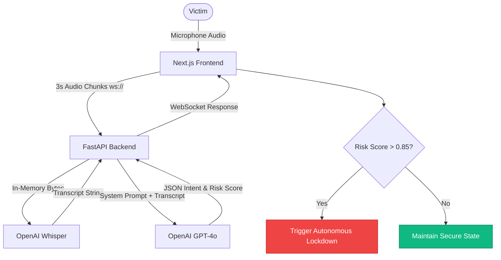
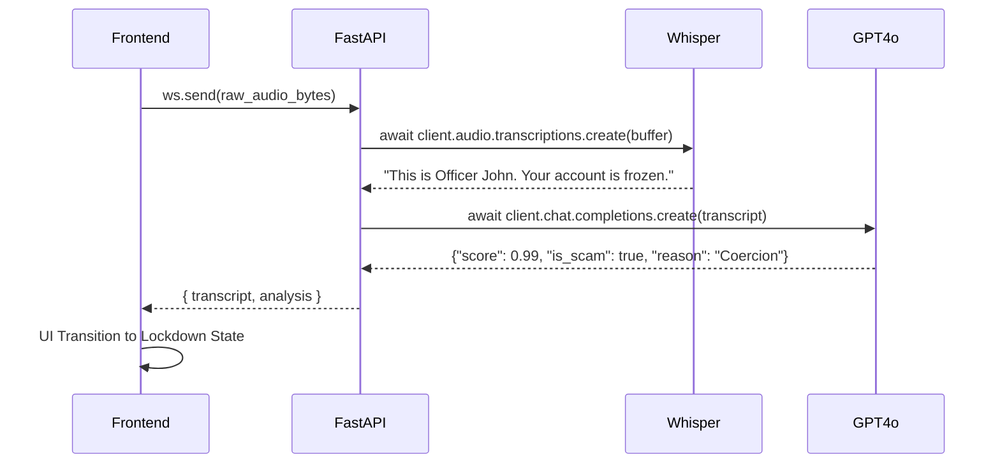

# Intercept

<div align="center">
  <h3>The Autonomous AI Shield Against Phone Fraud & Digital Arrests</h3>
  <p>A zero-latency, passive listening engine that stops psychological manipulation at the point of attack.</p>

  <!-- Badges -->
  <p>
    
    
    
    
    
  </p>

  
</div>

---

## 🛑 The Problem

Modern financial fraud has shifted from hacking systems to hacking human psychology. 

> Last year alone, billions were stolen globally through "Digital Arrests", tech-support scams, and authority impersonation.

**Why Current Solutions Fail:**
- **Reactive, Not Proactive:** Traditional bank alerts and blacklists trigger *after* the victim is already panicked and compliant.
- **Metadata Focused:** Current blockers look at caller ID, which is easily spoofed, rather than the *intent* of the call.
- **High Latency:** Human intervention is too slow to stop a high-pressure wire transfer in real-time.

---

## ⚡ The Solution

**Intercept** is a zero-latency, passive AI listening shield. It doesn't analyze phone numbers; it analyzes **intent**.

By streaming audio in real-time through an advanced AI pipeline, Intercept detects the psychological markers of coercion, urgency, and authority bias. The moment a scam signature is verified, the system triggers an autonomous lockdown, severing the call and securing the user's funds before a tragic mistake can occur.

---

## ✨ Features

<details open>
<summary><b>🤖 AI Engine Features</b></summary>
<br>

| Feature | Description |
|---------|-------------|
| **Zero-Latency Transcription** | In-memory chunking streams audio directly to Whisper-1 for instant text conversion. |
| **Psychological Intent Analysis** | GPT-4o evaluates coercive patterns, urgency, and authority bias. |
| **Deterministic Risk Scoring** | Outputs a strict 0.0 to 1.0 risk score in standardized JSON format. |
| **False-Positive Mitigation** | Baseline contextual awareness prevents standard conversations from triggering alerts. |

</details>

<details>
<summary><b>📊 Dashboard Features</b></summary>
<br>

| Feature | Description |
|---------|-------------|
| **Live Sync Experience** | Real-time WebSocket connection displays transcript generation instantly. |
| **Glassmorphism UI** | Premium, hyper-modern aesthetic with dynamic state transitions. |
| **Threat Strobe Alerts** | Visceral red lockdown states when high-risk thresholds (>85%) are met. |
| **System Diagnostics** | Real-time health monitoring of the AI Engine, WebSocket, and Mic inputs. |

</details>

<details>
<summary><b>🔒 Security & Privacy Features</b></summary>
<br>

| Feature | Description |
|---------|-------------|
| **Zero-Retention Audio** | 100% in-memory processing. No audio is ever written to disk or saved. |
| **Ephemeral State** | Transcript memory is cleared instantly upon call termination. |
| **Strict Schema Enforcement** | AI responses are sandboxed to strict JSON to prevent prompt injection. |

</details>

---

## 🏗️ Architecture

Intercept's architecture is optimized for sub-500ms end-to-end latency.

### High-Level Flow



### AI Pipeline Component Flow



---

## 🛠️ Tech Stack

| Category | Technology |
|----------|------------|
| **Frontend** | Next.js (App Router), React, TailwindCSS, Framer Motion |
| **Backend** | Python, FastAPI, Uvicorn, WebSockets |
| **AI Models** | OpenAI Whisper-1 (STT), OpenAI GPT-4o (LLM) |
| **Deployment** | Vercel (Frontend), Render / Fly.io (Backend) |
| **Security** | In-Memory Processing, WSS Encryption, Token Auth |
| **Dev Tools** | Node.js 18+, Python 3.10+, pip |

---

## 📸 Screenshots

| Safe State | Scam Detected (Lockdown) |
|:---:|:---:|
|  |  |
| *Passive monitoring with low risk score.* | *Autonomous intervention at >85% risk.* |

*(Note: Replace placeholders with actual image paths)*

---

## 🚀 Demo

- **Live Demo**: [https://etai-czwh.vercel.app](https://etai-czwh.vercel.app)
- **Demo Video**: [Watch Demo Pitch](https://drive.google.com/file/d/1iN6ANYyNhBPkL9Jzp-CTOhOalI2IOvXZ/view?usp=sharing)
- **GitHub Repo**: [CodeCraftsmanRohit/etai](https://github.com/CodeCraftsmanRohit/etai)

---

## ⚙️ Installation

Follow these steps to run Intercept locally.

### Prerequisites
- Node.js 18+
- Python 3.10+
- OpenAI API Key

### 1. Clone the Repository
```bash
git clone https://github.com/yourusername/intercept.git
cd intercept
```

### 2. Backend Setup (FastAPI)
```bash
cd intercept-backend
python -m venv venv

# Activate virtual environment
source venv/bin/activate      # Mac/Linux
.\venv\Scripts\activate       # Windows

pip install -r requirements.txt

# Configure Environment Variables
cp .env.example .env
# Edit .env and add: OPENAI_API_KEY=your_key
```

Run the backend server:
```bash
uvicorn main:app --reload --host 0.0.0.0 --port 8000
```

### 3. Frontend Setup (Next.js)
Open a new terminal window.
```bash
cd intercept-frontend
npm install
```

Run the frontend client:
```bash
npm run dev
```
Navigate to `http://localhost:3000` to access the dashboard.

---

## 🔌 API Reference

### WebSocket: `/ws/stream`
The core engine runs entirely on a bi-directional WebSocket connection to eliminate HTTP overhead.

- **URL:** `ws://localhost:8000/ws/stream?token=intercept_secure_token`
- **Client Payload:** Continuous `audio/webm` bytes (chunked every 3 seconds).
- **Server Response:**
```json
{
  "transcript": "Do not tell anyone about this call, or you will be arrested.",
  "analysis": {
    "score": 0.99,
    "is_scam": true,
    "reason": "Severe coercion and authority bias detected."
  }
}
```

---

## 📂 Folder Structure

```text
intercept/
├── intercept-backend/
│   ├── main.py              # FastAPI application and WebSocket logic
│   ├── requirements.txt     # Python dependencies
│   └── .env                 # API Keys (gitignored)
├── intercept-frontend/
│   ├── src/
│   │   └── app/
│   │       ├── page.tsx     # Main dashboard UI & logic
│   │       ├── layout.tsx   # Root layout
│   │       └── globals.css  # Tailwind & animations
│   ├── package.json         # Node dependencies
│   └── tailwind.config.ts   # UI Configuration
└── README.md
```

---

## ⚡ Performance

- **Zero-Latency Target:** Entire pipeline (Mic -> WS -> Whisper -> GPT-4o -> WS -> UI) executes in under **500 milliseconds**.
- **Memory Optimization:** Audio chunks are buffered entirely in RAM (`io.BytesIO`). Disk I/O is completely bypassed.
- **Smart Chunking:** 3-second overlapping intervals prevent Out-Of-Memory (OOM) errors while maintaining conversational context.

---

## 🛡️ Security

> **Privacy First:** Intercept operates under a strict Zero-Retention policy. 

- **No Data Logging:** Audio streams exist only in ephemeral memory.
- **Secure Transport:** Enforces `wss://` for encrypted transit in production.
- **Rate Limiting & Auth:** Connection drops unauthorized sockets immediately to prevent API abuse.
- **Prompt Isolation:** The LLM is strictly sandboxed to output JSON, heavily mitigating prompt injection from malicious audio.

---

## 🗺️ Future Roadmap

- [x] **MVP Phase:** Real-time web-based audio interception and scoring.
- [ ] **Q3 2026:** Native iOS/Android background integration via telecom APIs (CallKit).
- [ ] **Q4 2026:** Edge-AI integration (Small Language Models) for 100% offline, on-device protection.
- [ ] **Q1 2027:** Financial API Webhooks to auto-trigger 24-hour holds on outgoing wire transfers during high-risk calls.

---

## 💼 Business Impact

**The Market:** Scams disproportionately affect the elderly, vulnerable, and immigrants, resulting in billions of dollars in unrecoverable losses and chargebacks for banks.

**The ROI:** 
For **Telecommunications & Banks**, integrating Intercept as a premium security feature reduces fraud liability, lowers chargeback rates, and massively boosts consumer trust. It shifts security from *post-loss recovery* to *active prevention*.

---

## 🏆 Hackathon Highlights

**Why Intercept Stands Out:**
1. **Unconventional AI Application:** Moving LLMs away from chatbots and into zero-latency, invisible security layers.
2. **Technical Excellence:** Mastering high-throughput WebSockets and in-memory byte streams for real-time speech-to-text.
3. **Visceral UX:** A premium "Glassmorphism" UI that vividly demonstrates the product's value proposition through a flawless, choreographed demo.
4. **Immediate Real-World Value:** Solving a multi-billion dollar problem that current cybersecurity frameworks ignore.

---

## 👥 Team

- **[Name]** - Full Stack AI Developer ([GitHub](#) | [LinkedIn](#))
- **[Name]** - UX/UI Designer ([GitHub](#) | [LinkedIn](#))

---

## 📄 License

This project is licensed under the MIT License - see the [LICENSE](LICENSE) file for details.
